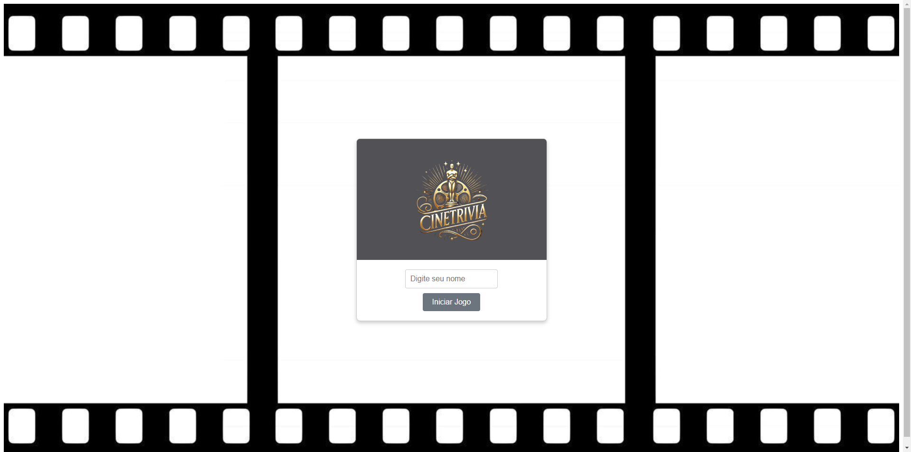
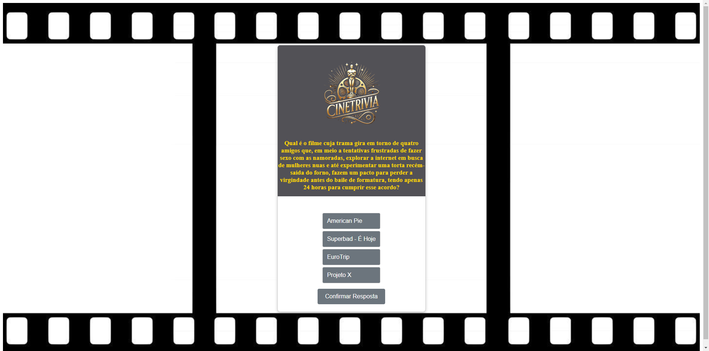

# 🎬 CineTrivia

Bem-vindo ao **CineTrivia**, um jogo de perguntas e respostas sobre cinema!  
Teste seus conhecimentos sobre filmes clássicos e contemporâneos, ganhe pontos e veja se você realmente entende de cinema! 🍿🎥

---

## 🚀 Tecnologias e Ferramentas Utilizadas

### **Frontend (React)**
- **Linguagem:** JavaScript (ES6+)
- **Framework:** [React.js](https://reactjs.org/)
- **Bibliotecas:**
  - **React FontAwesome** → Ícones no jogo
  - **React Hooks** → Gerenciamento de estado
  - **React Router** → Navegação (se necessário)
  - **CSS3** → Estilização

### **Backend (API .NET)**
- **Linguagem:** C# (.NET 8)
- **Framework:** ASP.NET Core Web API
- **Banco de Dados:** SQL Server + Entity Framework Core
- **CORS:** Configurado para permitir requisições do React

---

## 🎮 Como Rodar o Projeto?

### **1️⃣ Clonar o Repositório**
```sh
git clone https://github.com/wildias/CineTrivia.git
cd CineTrivia

### **2️⃣ Instalar as Dependências (Frontend)**
```sh
npm install

### **3️⃣ Rodar o Frontend**
```sh
npm npm start

O jogo estará disponível em http://localhost:3000.

# 🌐 API (CineTrivia.Api)

O backend é uma API em .NET 8, que gerencia as perguntas e respostas do jogo.

### **1️⃣ Clonar o Repositório**
```sh
git clone https://github.com/wildias/CineTrivia.Api.git
cd CineTrivia.Api

### **2️⃣ Configurar Banco de Dados**

Antes de rodar a API, crie um banco de dados SQL Server e edite o appsettings.json com sua conexão.

### **3️⃣ Rodar a API**
```sh
dotnet run

A API estará disponível em https://localhost:5000/api/Jogos.

## Endpoints Principais

GET /api/cinetrivia → Retorna uma lista de perguntas do jogo.
POST /api/cinetrivia → Adiciona uma nova pergunta (se necessário).
PUT /api/cinetrivia/{id} → Atualiza uma pergunta.
DELETE /api/cinetrivia/{id} → Remove uma pergunta.

⚠️ Certifique-se de que a API está rodando antes de iniciar o jogo no React.

# 📷 Capturas de Tela





## 🤝 Contribuições
Quer contribuir para o projeto?
Sinta-se à vontade para abrir issues e enviar pull requests!

👨‍💻 Autor
Criado por Wil Dias.
📧 Contato: wildiasdev@gmail.com
🔗 GitHub: github.com/wildias